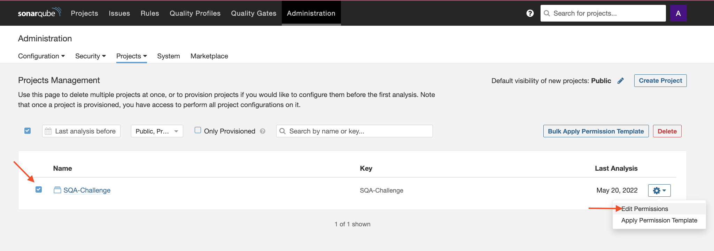
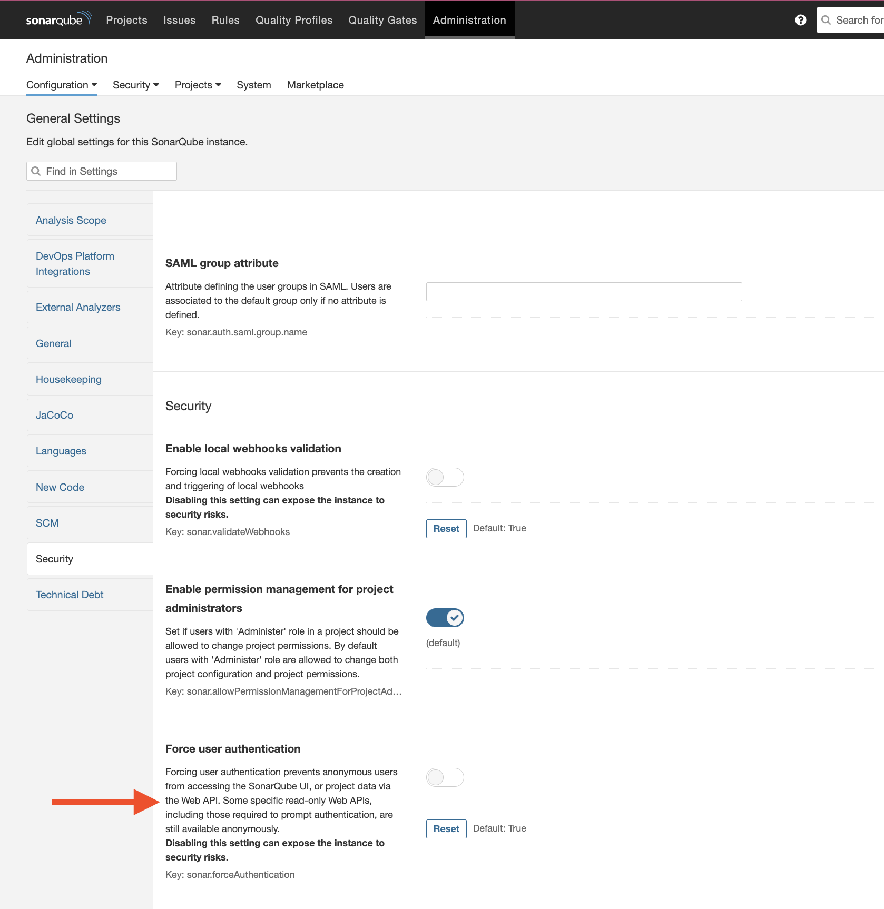
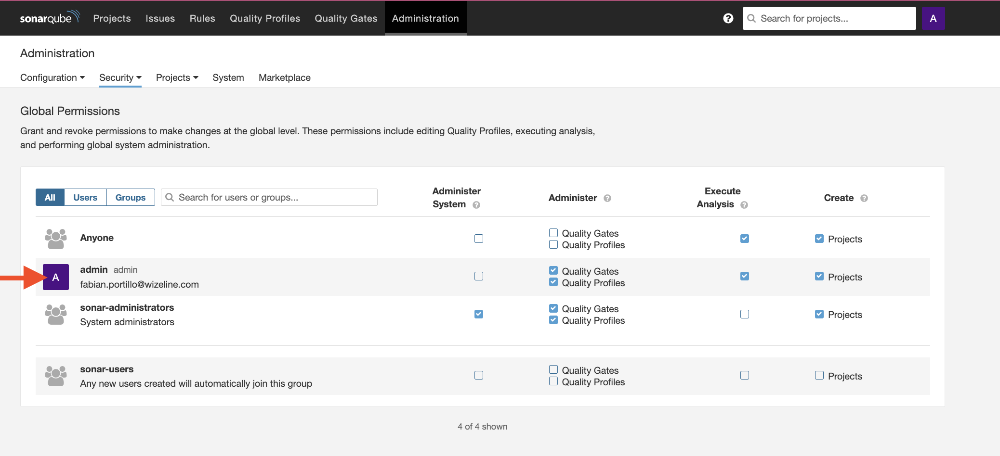
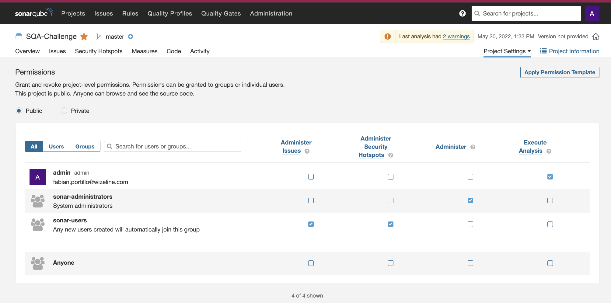
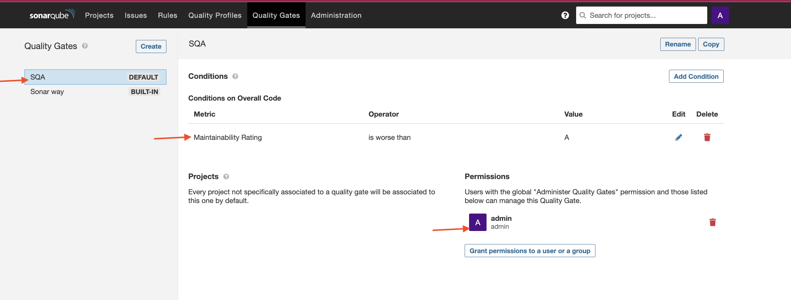
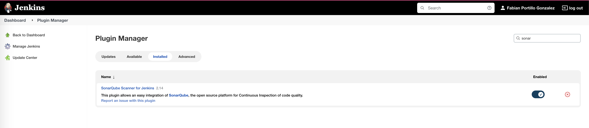
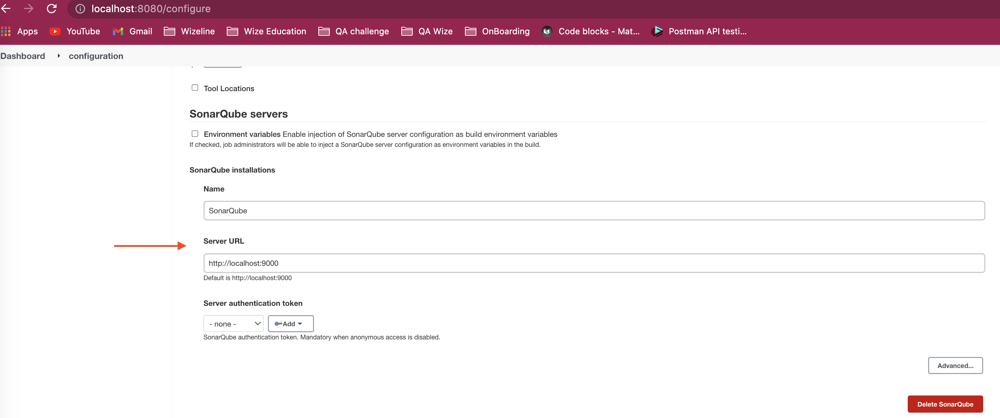
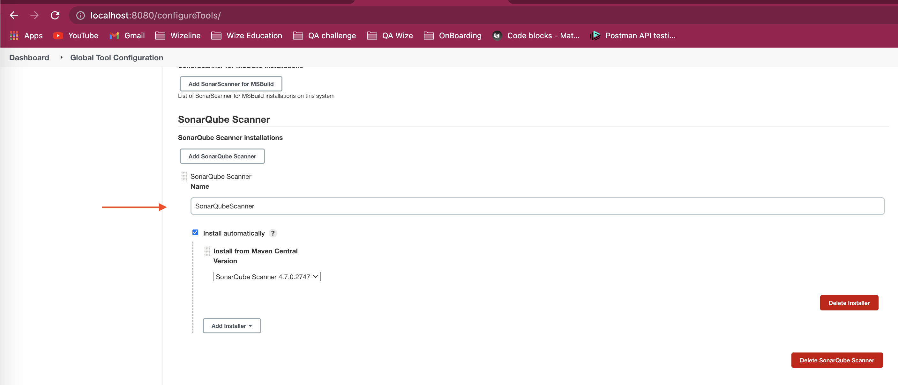

### **Sonarqube**

**Installation**:

1. I followed this [guide](https://medium.com/@lazyprogram/setup-sonarqube-on-mac-osx-c16a161d07d5) to install and start Sonarqube in localhost with port 9000
2. I created a SonarScanner tool in Jenkins as shown in this [guide](https://igorski.co/sonarqube-scans-using-jenkins-declarative-pipelines/)
3. To configure [Sonarqube with jenkins](https://tomgregory.com/sonarqube-quality-gates-in-jenkins-build-pipeline/) I followed those steps, except for the Jenkinsfile sh commands, for that I followed [this](https://igorski.co/sonarqube-scans-using-jenkins-declarative-pipelines/) except for configuring *sonar-project.properties* file because for that I based on internet stuff and official documentation of Sonarqube.
___

### **Sonarqube configuration**:

1. **Create project:** *Create project > manually > Write name* 

2. **Enable scan code** with sonar without force user credentials: *Administration > Security > Force user authentication (disable)*

3. **Set permissions** to the project: *Administration > Project > Management >* 

4. **Quality Gates:** *Quality Gates > create > "name"*
   1. **Add condition:** You can create new conditions according of your needs and choose if you want to apply to "On new code" or "overall code".
   2. **Grant permissions** to the previous user you created to link it to this Quality Gate. 
   

5. You can choose if select **as default** the new Quality Gate you created or select the one with name "Sonar Way" with the default metrics already has.

___
### **Jenkins configuration**

1. **Plugin:** Verify if Sonarqube plugin is already installed.

1. **SQ server:** Manage > Configuration > SonarQube servers > add

2. **SQ scanner:** Manage > Global Tool Configuration > SonarQube Scanner > add

___
### **Jenkinsfile**

This is how it looks the stages for Sonarqube:

        stage('Static Analysis - Sonarqube') {
            environment {
                SCANNER_HOME = tool 'SonarQubeScanner'
                PROJECT_NAME = 'SQA-Challenge'
             } 
            steps {
                echo 'running Sonarqube..'
                    echo "${SCANNER_HOME}"
                    withSonarQubeEnv('SonarQube') {
                    sh '''
                        ${SCANNER_HOME}/bin/sonar-scanner \
                        -Dsonar.projectKey="${PROJECT_NAME}" 
                        '''
                } 
            } 
        }
        stage('Quality Gate - Sonarqube') {
            steps {
                echo 'waiting for QualityGate Sonarqube..'
                    waitForQualityGate abortPipeline: true
            } 
        } 